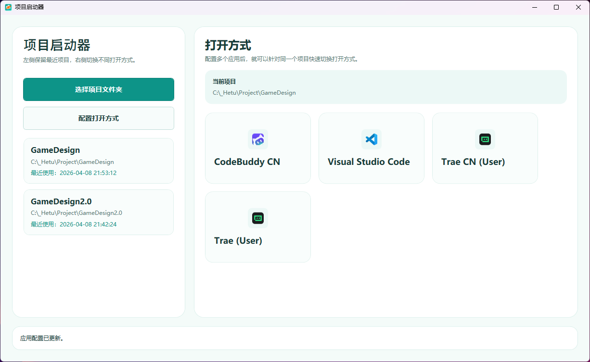
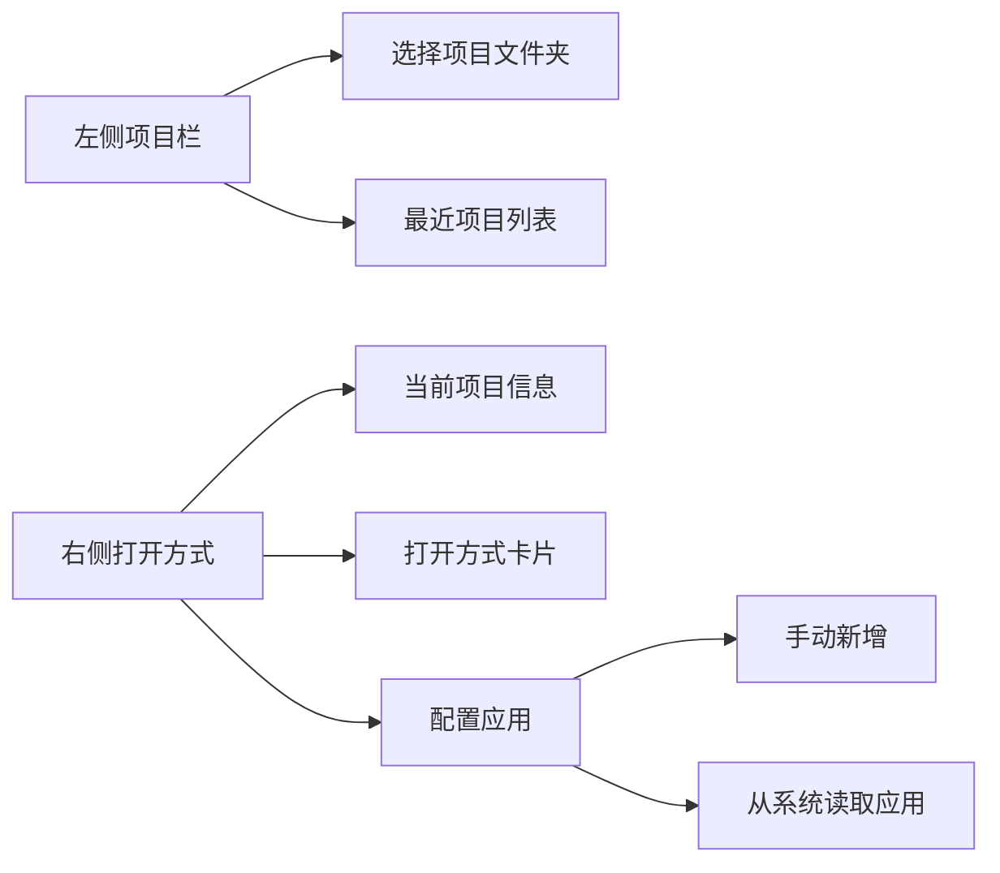

# 项目启动器

一个基于 `WPF + .NET 8` 的 Windows 项目启动工具，用于在多个项目文件夹之间快速切换，并使用不同应用打开同一个项目。



## 项目概览

| 项目项 | 说明 |
|---|---|
| 技术栈 | WPF、.NET 8、Windows 注册表读取 |
| 运行平台 | Windows |
| 配置存储 | `%AppData%\\ProjectOpenTools\\settings.json` |
| 核心能力 | 最近项目、应用配置、注册表导入应用、图标自动读取 |
| 可执行文件 | 项目根目录下的 `项目启动器.exe` |

## 主要功能

| 功能 | 说明 |
|---|---|
| 选择项目文件夹 | 选择后自动加入最近项目列表 |
| 最近项目切换 | 左侧独立项目栏，按最近使用时间排序 |
| 多应用打开 | 右侧展示打开方式卡片，支持快速切换 |
| 手动配置应用 | 可手动录入应用名称、路径和参数模板 |
| 系统读取应用 | 可从注册表导入应用名称、路径和图标 |
| 本地持久化 | 重启软件后仍保留最近项目和应用配置 |

## 界面结构



## 使用说明

### 1. 选择项目

1. 点击左侧 `选择项目文件夹`
2. 选择目标项目目录
3. 项目会自动进入最近项目列表

### 2. 配置打开方式

1. 点击左侧 `配置打开方式`
2. 选择以下任一方式：

| 方式 | 说明 |
|---|---|
| 新增 | 手动填写应用名称、`exe` 路径、参数模板 |
| 从系统读取 | 从 Windows 注册表扫描应用并导入 |
| 编辑 | 修改已有应用配置 |
| 删除 | 删除不再需要的打开方式 |

### 3. 使用应用打开项目

1. 在左侧选择一个项目
2. 在右侧点击某个应用卡片
3. 程序会按参数模板启动对应应用

## 参数模板说明

| 模板示例 | 说明 |
|---|---|
| `{projectPath}` | 默认仅传入项目路径 |
| `--folder-uri {projectPath}` | 用带参数的方式打开项目 |
| `--reuse-window {projectPath}` | 复用现有窗口打开项目 |

## 目录结构

| 路径 | 说明 |
|---|---|
| `src/ProjectOpenTools/` | 主应用源码 |
| `tests/ProjectOpenTools.Tests/` | 单元测试 |
| `dist/` | 根目录下的运行产物归档目录 |
| `src/ProjectOpenTools/Assets/AppIcon.ico` | 项目图标 |

## 构建与运行

### 调试构建

```powershell
dotnet build .\\src\\ProjectOpenTools\\ProjectOpenTools.csproj
```

### 发布前验证

```powershell
dotnet build .\\tests\\ProjectOpenTools.Tests\\ProjectOpenTools.Tests.csproj -p:UseSharedCompilation=false
dotnet vstest .\\tests\\ProjectOpenTools.Tests\\bin\\Debug\\net8.0-windows\\ProjectOpenTools.Tests.dll
```

### 直接运行

```powershell
.\\dist\\项目启动器.exe
```

## 当前实现说明

| 项 | 说明 |
|---|---|
| 最近项目记忆 | 已实现 |
| 应用列表记忆 | 已实现 |
| 项目对应默认打开方式 | 当前未实现 |
| 完整使用统计 | 当前未实现 |
| 跨平台支持 | 当前未实现，仅支持 Windows |

## 后续可扩展方向

| 方向 | 说明 |
|---|---|
| 项目搜索 | 最近项目较多时支持快速检索 |
| 收藏应用 | 将常用打开方式固定到顶部 |
| 项目标签 | 按引擎、语言或团队分类 |
| 默认打开方式 | 给每个项目记住一个默认应用 |
